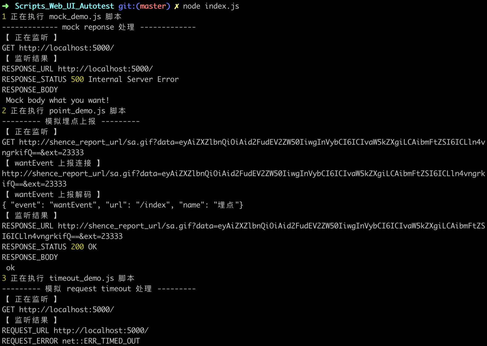
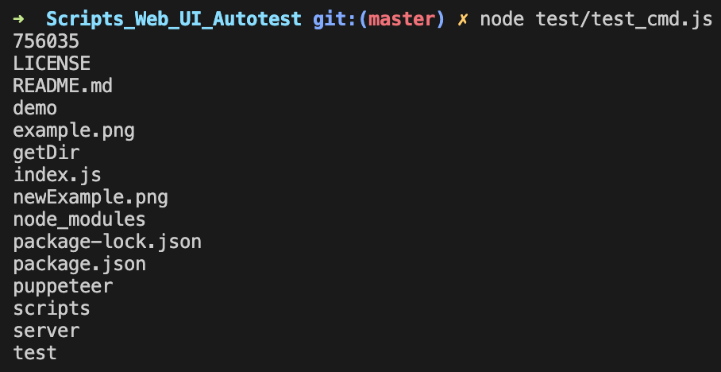

## Scripts_Web_UI_Autotest

简介: 在前端 UI 自动化测试中，提供类抓包工具的拦截 url 断点处理和 mock 数据等功能， 并集成埋点自动化测试，让你的前端自动化彻底摆脱后端和抓包工具的束缚，直接起飞。

技术栈: node.js && puppeteer

备注: demo 里面通过 goto.url 的方式来触发拦截，实际上可以通过模拟自动点点点的方式来触发拦截，支持监听正常 Response 做校验断言，也支持拦截超时，中断请求，mock数据等各种异常状态的模拟，已封装好函数可快捷调用实现。

下列图片无法加载请访问 testerhome: https://testerhome.com/topics/24699

## Usage

```
# 部署项目
git clone https://github.com/ShaoNianyr/Scripts_Web_UI_Autotest
cd Scripts_Web_UI_Autotest

# 跳过 puppeteer 的 chronium 安装
npm i --ignore-scripts

# 手动访问如下地址版本下载 puppeteer 的 chronium，解压至项目根目录下
https://storage.googleapis.com/chromium-browser-snapshots/Mac/756035/chrome-mac.zip

# 启动 demo 拦截测试
node index.js
```

## Methods

```
1. 正常监听 request 和 reponse
scripts_listen(page, listen_url);

2. 模拟异常中断 request
scripts_abort(page, timeout_url, abort_type);

3. mock reponse
scripts_mock(page, mock_url, mock_status_code, mock_application_type, mock_body);

4. 监听埋点上报信息
scripts_point(page, point_url);

5. 获取埋点上报信息
# 提取埋点上报连接的埋点数据
scripts_convert.pointData(point_url);
# base64 加密
scripts_convert.base64Encode(point_data);
# base64 解密
scripts_convert.base64Decode(point_data);

6. 执行 cmd 功能
scripts_cmd.cmd(shell);
```

## View

### listen & mock & point



### cmd



## Contributing

[Puppeteer](https://github.com/puppeteer/puppeteer)

## License

Open source licensed under the MIT license (see LICENSE file for details).