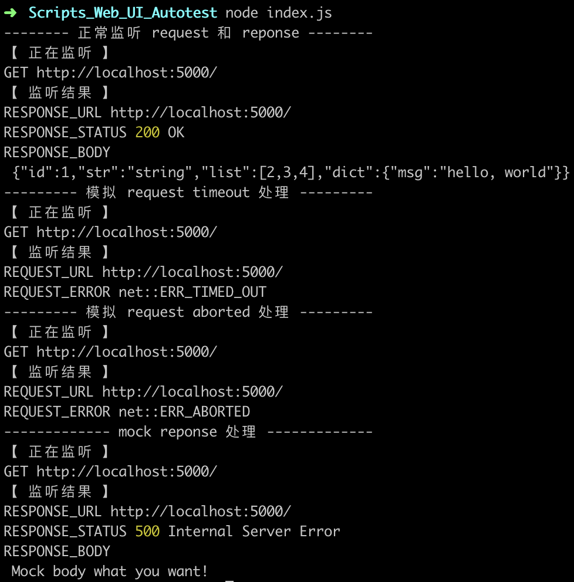

## Scripts_Web_UI_Autotest

简介: 一款结合 breakpoint && mock 的 Web-UI 自动化测试工具，让你的前端自动化彻底摆脱后端和抓包工具的束缚，直接起飞。

技术栈: node.js && puppeteer

## Usage

```
# 部署项目
git clone https://github.com/ShaoNianyr/Scripts_Web_UI_Autotest
cd Scripts_Web_UI_Autotest

# 跳过 puppeteer 的 chronium 安装
npm i --ignore-scripts

# 手动访问如下地址版本下载 puppeteer 的 chronium，解压至项目根目录下
https://storage.googleapis.com/chromium-browser-snapshots/Mac/756035/chrome-mac.zip

# 启动 demo 后端
cd server
node app.js

# 启动 demo 拦截测试
cd ..
node index.js
```

## View



## Contributing

[Puppeteer](https://github.com/puppeteer/puppeteer)

## License

Open source licensed under the MIT license (see LICENSE file for details).